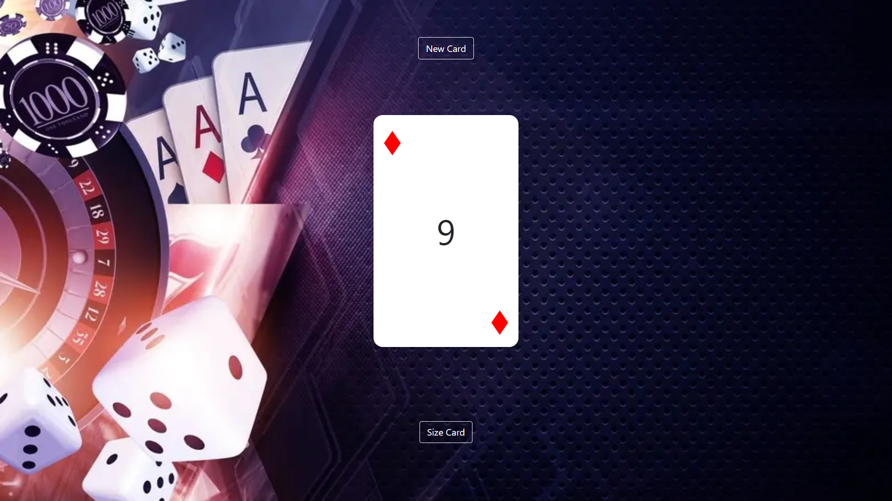

# Random Card Generator




## Intrucciones

####  Crea un algoritmo que genere aleatoriamente una carta en cada actualización:

1) Cada vez que el sitio web actualiza una nueva carta aleatoria debe mostrarse.

2) La carta debe tener una de las posibles palo/pinta: Corazones, Picas, Clubes y Diamantes.

3) El valor de la carta debe ser uno de los siguientes: 2 a 10, Rey, Reina, Jota o As (sin comodín).


#### 😎 ¿Te sientes seguro?

¡Los siguientes requeriemientos no son necesarios para completar satisfactoriamente el proyecto pero puedes intentar retarte a ti mismo!

+1 Agrega un botón que genere una nueva carta cuando sea apretado.

+1 Agrega un timer que genere una nueva carta automaticamente cada 10 segundos. (En mi caso el temporizador es de 5 segundos)

+1 Permítele al usuario especificar el width y height de la carta utilizando text-inputs.

### Instalación Manual

1) Remember to install the npm packages first:
```
$ npm install
```

2) Build and Start coding!

Build the application for the first time...

```
$ npm run start
```


